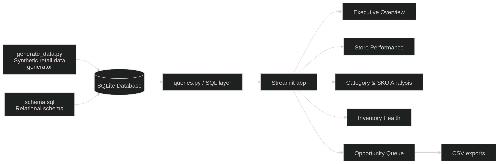

# Mamboo Retail Intelligence Dashboard

A polished Streamlit analytics app for a fictional South African storage, plastics, and home retail chain. The project simulates a real-world retail BI workflow using Python, SQL, synthetic data generation, and interactive dashboards.

## What this project demonstrates
- Retail KPI design for multi-branch operations
- SQL-backed analytical modelling with SQLite
- Streamlit app development for business stakeholders
- Inventory and replenishment analysis
- Promotion and discount effectiveness analysis
- Portfolio-ready storytelling for GitHub and job applications

## Why this project works for a portfolio
This is positioned as a decision-support dashboard rather than a generic sales report. The app answers the kinds of questions a retail operations manager, merchandising lead, or analyst would care about:
- Which branches are strong but availability-constrained?
- Which categories drive revenue versus margin?
- Which SKUs should be protected, replenished, transferred, or rationalised?
- Is discounting creating profitable growth?

## Tech stack
- Python
- Streamlit
- SQLite
- Pandas
- Plotly
- Faker / NumPy for synthetic data generation

## Dashboard modules
### 1. Executive Overview
Answers:
- How much revenue and gross profit did the business generate?
- Which categories and stores contribute most to performance?
- What are the key signals around stockouts and inventory velocity?

### 2. Store Performance
Answers:
- Which branches are leading or lagging?
- Are weak stores suffering from low demand, low margin, or availability issues?
- Which stores warrant operational intervention?

### 3. Category & SKU Analysis
Answers:
- Which categories and subcategories drive revenue?
- Which SKUs are hero products versus underperformers?
- How concentrated is value across the SKU base?

### 4. Inventory Health
Answers:
- Which products are at risk of stockout?
- Which SKUs should be replenished first?
- Where might inter-store stock transfers reduce availability risk?

### 5. Promotion & Discount Insights
Answers:
- Which discount bands generate profitable growth?
- Which promotions created the most revenue and gross profit?
- Where is discounting helping versus eroding margin?

### 6. Opportunity Queue
Answers:
- Which SKU-store combinations should managers act on first?
- Where can stock transfers reduce missed sales?
- Which actions deserve escalation right now?

## Project structure
- `app.py` - main Streamlit application
- `utils/queries.py` - SQL extraction layer
- `generate_data.py` - reproducible synthetic retail data generator
- `schema.sql` - relational schema
- `assets/style.css` - custom dashboard styling
- `.streamlit/config.toml` - local theme configuration
- `mambo_retail.db` - generated SQLite database
- `requirements.txt` - dependencies
- `INSIGHTS.md` - example business narratives for your README, interviews, or demo
- `.gitignore` - clean repo defaults

## How to run locally
```bash
python3 -m venv .venv
source .venv/bin/activate
pip install -r requirements.txt
python generate_data.py
streamlit run app.py
```

## Suggested GitHub positioning
Use language like this in your repo description or job application:

> Retail intelligence dashboard built with Streamlit, Python, and SQL to analyse store performance, category profitability, inventory health, and promotion effectiveness for a multi-branch South African home and storage retailer.

## Suggested screenshots for the repo
Capture and add:
- Executive overview hero + KPI row
- Store performance scatter plot
- Category treemap and SKU scatter plot
- Inventory replenishment table
- Opportunity queue / transfer suggestions

## Strong portfolio talking points
- Built a reusable SQL extraction layer instead of hardcoding all logic inside the UI.
- Created realistic synthetic transaction, inventory, promotion, and customer data.
- Added benchmark deltas against the previous period to make KPIs more decision-ready.
- Included action-oriented outputs such as replenishment queues, stock transfer candidates, and opportunity scoring.
- Designed the UI to feel closer to a production stakeholder dashboard than a notebook output.

## Suggested GitHub README extras
Add these once you publish:
- 4 to 6 screenshots after running the app locally
- a short architecture diagram or ERD
- a section called `Business Recommendations`
- your LinkedIn and live demo link if you deploy it

## Good demo script for interviews
A tight walkthrough can sound like this:
1. Start on the executive page and frame the commercial story.
2. Move into store performance to show branch-level outliers.
3. Use category and SKU analysis to discuss hero products and assortment concentration.
4. Open inventory health to show where stock risk or excess stock exists.
5. End on the opportunity queue to show how analytics translates into action.

erDiagram
    STORES ||--o{ SALES_TRANSACTIONS : has
    PRODUCTS ||--o{ SALES_TRANSACTIONS : sold_in
    CUSTOMERS ||--o{ SALES_TRANSACTIONS : makes
    PROMOTIONS ||--o{ SALES_TRANSACTIONS : applies_to

    STORES ||--o{ INVENTORY_SNAPSHOTS : holds
    PRODUCTS ||--o{ INVENTORY_SNAPSHOTS : tracked_in

    STORES {
        int store_id PK
        string store_name
        string province
        string city
        string format_type
    }

    PRODUCTS {
        int product_id PK
        string sku
        string category
        string subcategory
        string product_name
        float unit_cost
        float unit_price
    }

    CUSTOMERS {
        int customer_id PK
        string customer_segment
        string loyalty_tier
    }

    PROMOTIONS {
        int promo_id PK
        string promo_name
        string promo_type
        float discount_pct
        date start_date
        date end_date
    }

    SALES_TRANSACTIONS {
        int transaction_id PK
        date order_date
        int store_id FK
        int product_id FK
        int customer_id FK
        int promo_id FK
        string channel
        int units_sold
        float sales_amount
        float discount_amount
        float gross_profit
    }

    INVENTORY_SNAPSHOTS {
        int snapshot_id PK
        date snapshot_date
        int store_id FK
        int product_id FK
        int stock_on_hand
        int reorder_point
        int days_of_cover
    }
}

